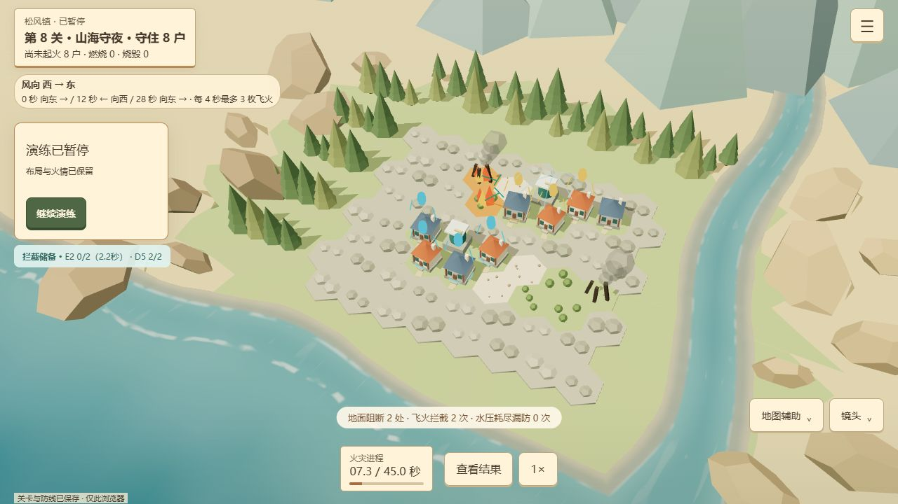

# 火线街区 · Fireline

**[▶ 直接在线游玩](https://jiuxiaoyijian.github.io/mora-fireline/)** · **[GitHub 项目](https://github.com/jiuxiaoyijian/mora-fireline)** · [开发迭代与评审导读](docs/13-开发迭代与评审导读.md)

Mora 游戏策划 Vibe Coding 测试作品，选择**方向二：建造与灾害模拟**。这是一个可在浏览器直接运行的 3D 防灾规划原型，无需下载、登录或配置开发环境。

你是林缘小镇「松风镇」的防灾规划员。居民已经撤离，家园留在原地。用有限预算布置防火带和喷淋，在山火、飞火与转向风中守住住宅；观察哪里失守，再修改防线验证自己的判断。



*项目实机截图，展示第八关暂停观察状态；场景、设施和火情由 Three.js 实时渲染。*

## 先玩一轮

1. 打开网页，从第一关进入：阅读保护目标和天气，在可建设的草地上布置设施，住宅位置固定。
2. 点击「开始演练」，观察火如何传播。单次演练为 **20–45 秒**，支持暂停、2× 加速和直接计算完整结果。
3. 结算后查看起火线索，保留布局修改并重试。达成保护目标解锁下一关；全保且达到节约预算目标可获三星。

前 3 关学习隔离、绕行与降温，第 4 关引入跨越防线的飞火，第 5–8 关组合住宅材质、转向风与补给压力。关卡逐步解锁；时间有限时可先完成首关，再从[迭代导读](docs/13-开发迭代与评审导读.md)查看第 4、7 关的设计和验证证据。

| 操作 | 方式 |
| --- | --- |
| 查看 / 防火带 / 喷淋 / 拆除 | 游戏内工具按钮，或数字键 1 / 2 / 3 / 4；未开放工具不可用 |
| 连续铺设 / 撤销 | 选择防火带后拖动；撤销按钮或 Ctrl/Cmd+Z |
| 开始、暂停 / 菜单 | 游戏内按钮或空格；Esc 打开菜单或关闭弹层 |
| 镜头 | 滚轮缩放、右键拖动环视，也可使用游戏内镜头按钮 |

每关防线、解锁和最好星级保存在**当前浏览器**；刷新不恢复进行中的火情，跨设备不会自动同步。完整规则见[当前游戏规则](docs/07-当前游戏规则.md)。

## 玩法设计：让布局改变结果

核心循环：**建设防线 → 启动实验 → 观察传播与损失 → 调整布局 → 在相同条件下重试**。

本项目把建造范围收敛为「为固定聚落布置防灾设施」。初版曾允许搬迁住宅，后续改为固定保护对象，使玩家集中判断哪里需要隔离、哪里值得投入喷淋。未扩展城市经济、自由建城和多灾害系统，优先完成可解释、可重复验证的一局。

| 决策 | 作用与限制 |
| --- | --- |
| 防火带，1 点/格 | 阻断经过该格的地面火，也可减少燃烧草地形成的飞火发射源；会被绕行或飞火跨越 |
| 喷淋，4 点/座 | 覆盖相邻一圈，共享降温能力与 2 次飞火拦截储备，每 4 秒补 1 次；不能扑灭已燃住宅 |
| 保护顺序与设施组合 | 木屋比砖屋更易起火，天气按预报转向；需在入口隔离、局部防护和预算之间取舍 |

同关、同布局得到一致结果，重试不会重新掷出有利天气。结果反馈包括保护户数、星级、最早起火事件及定位、飞火拦截与水压不足次数，让玩家有依据地修改下一版方案。

**一个实际迭代案例：**在当前第 7 关的参考布局中，两座喷淋保住 **5/8 户**；再加两格防火带切断草地跳板后，保住 **8/8 户**。这既有规则回归，也有 AI 浏览器操作记录，说明设施组合能改变结果；它仍不能证明所有玩家都能理解或愿意重试。见[关卡测试](src/sim/levels.test.ts)和[开发记录](docs/04-开发与试玩记录.md)。

## 使用了哪些 AI 工具，怎样协作

**实际使用的 AI Coding 工具：OpenAI Codex。**用于需求拆解、方案比较、代码实现、问题定位、测试与中文文档整理；通过其浏览器控制能力执行操作验收。Codex 内按任务调度子 Agent，完成过 UI 实现、测试补充和美术方案审查，再由主控集成。并非每轮都启动全部角色，也没有常驻自动验收服务。

| 参与方 | 实际职责 |
| --- | --- |
| 我（策划 / 提交者） | 选择并坚持建造与灾害方向，提供原型审核方法；确定温暖微缩风格，提出「更像游戏」、固定住宅、喷淋过强、持续卡顿、屋顶反馈不清楚和终章缺少完成感等反馈，决定优先级与取舍 |
| Codex 主控 | 将目标转成规则、关卡和交互；实现 TypeScript / Three.js 原型，维护 Git 与文档，集成修改并验证 |
| Codex 专项子 Agent | 按文件边界补充输入测试、实现 UI 或做只读审查；测试通过后仍由主控检查整体流程 |

**协作方式是逐轮提出问题、实现最小改动、验证并记录结果。**例如，我指出喷淋覆盖过大、后期过于通用后，Codex 将其改为一圈覆盖与共享拦截储备，重校关卡，再用失败布局和改进布局对照效果。对已知卡顿也保留未解决结论，没有把代码优化或测试通过写成玩家体验已达标。

Git/GitHub、Vite、Three.js、TypeScript 和 Node 测试运行器用于工程管理、实现和验证，不属于额外 AI 工具。运行中的模型、纹理、图标和提示音均由代码生成，**没有使用图像生成工具制作游戏资产**。

## 开发过程与关键迭代

| 阶段 / 问题 | 选择与改动 | 证据与当前边界 |
| --- | --- | --- |
| 选题与首个闭环 | 比较三个方向，选择布局能直接影响结果的火灾规划；先实现建造、模拟、复盘和重试 | [题目分析（历史）](docs/archive/01-题目解读与落地方案.md)、[对话摘要](docs/archive/03-人机协作对话摘要.md) |
| 初版结果过于两极 | 审核发现旧地图大量局部布局仍全损；改为六边形与岩带分区，逐步建立局部保护收益 | [原型审核（历史）](docs/archive/10-原型审核与候选比较.md)；旧单关结果不冒充八关数据 |
| 看起来像网页、身份不清楚 | 补主菜单、游戏内流程、巡护手记封面与木框纸面 HUD；温暖微缩场景对应防灾规划员身份 | [UI 设计与验证](docs/11-UI风格与交互层级.md)；当前 HUD 按视口响应式适配 |
| 目标与学习顺序不明确 | 固定住宅，设计八次渐进委托、星级和解锁；由隔离教学推进到飞火、风向和材料组合 | 八关均验证无防护失败及预算内全保 / 三星解；前几关仍依赖较直接提示 |
| 喷淋过强、火情难看懂 | 加入共享水压限制；把防护状态抬到屋顶，显示飞火预警、命中 / 拦截差异与复盘定位 | 第 7 关 5/8 → 8/8 的组合防护案例；难度曲线待真人验证 |
| 持续卡顿与终章不完整 | 修复镜头重复重置画布，静态合批、复用模型；补完结、复制成绩、确认重开和备份恢复 | 已有性能样本与浏览器验收；内置浏览器样本仍约 32 FPS，性能问题未宣称完全解决 |

详细过程按「问题—选择—实现—验证」整理在[评审导读](docs/13-开发迭代与评审导读.md)；[开发记录](docs/04-开发与试玩记录.md)保留逐轮结果，[提交历史](https://github.com/jiuxiaoyijian/mora-fireline/commits/main/)可追溯实际改动。

## 验证、未完成部分与取舍

截至本次整理，代码基线为 `b58cd25`：

- **自动检查：**重新运行 `npm run check`，62 项通过（45 项规则 / 播放 / 关卡、8 项输入、9 项性能结构），类型检查和生产构建通过。覆盖可行解、固定住宅、飞火与水压、风向、确定性重试、存档和渲染对象复用。
- **AI 浏览器验收：**此前记录已走通八关、失败后修改重试、终章及备份恢复，并检查桌面与横竖屏尺寸。本轮只核验线上入口与生产资源及重跑自动检查，未重新执行八关浏览器验收。
- **发布：**GitHub Pages 已上线；[基线部署记录](https://github.com/jiuxiaoyijian/mora-fireline/actions/runs/35210286761)成功。线上入口返回正常，脚本与本地生产构建文件名一致。
- **仍未完成：**独立首次玩家试玩、真实手机 / 低端设备验收、难度与设施取舍验证。已有用户开发反馈，不等于形成性真人试玩数据；桌面模拟尺寸和 CPU 基准也不能代替真机表现。

已知限制：性能样本尚不足以证明流畅；Three.js 分包仍有大于 500 kB 的构建提示；复盘只展示有限起火线索，不是完整因果回放。渐进提示、方案 A/B 保存对照、关卡变体仍是[后续规划](docs/14-玩法循环与体验优化规划.md)，不是已交付功能。暂不做云存档、联机、城市经济和长期数值成长，把后续工作优先留给性能、失败诊断和玩家验证。

## 实际用时说明

**人工实际投入约 8 小时**：2026-09-14（周一）至 09-17（周四），每天约 2 小时，来自提交者对实际投入的回忆统计，未使用计时器精确记录。AI 执行时长未单独统计，不与人工时间混算；并行任务耗时也不相加。早期方案中的 16–24 小时是立项估算，不是此次实际用时。

## 工程与本地运行

使用 TypeScript + Three.js + Vite。规则模拟以 **0.1 秒固定步长**运行，与渲染帧率分离；确定性天气 / 飞火用于同条件重试。纯静态构建，支持 GitHub Pages 仓库子路径。

| 入口 | 职责 |
| --- | --- |
| [src/sim](src/sim/) | 六边形规则、关卡数据、火灾模拟、成绩与存档校验及测试 |
| [src/main.ts](src/main.ts) | 单局 / 关卡流程、输入接入、保存、结果与重试 |
| [src/view.ts](src/view.ts)、[src/ui](src/ui/) | Three.js 场景、交互拾取、响应式 HUD 与弹层 |
| [src/input](src/input/)、[tests](tests/) | 指针手势与测试、性能结构回归 |
| [docs](docs/README.md) | 现行规则、设计依据、开发记录、来源与待办；历史方案在 archive |

使用 [.nvmrc](.nvmrc) 指定的 Node.js 24.13.1：

```sh
npm ci
npm run dev      # 本地开发
npm run check    # 规则 / 输入 / 性能检查、类型检查、生产构建
npm run preview  # 预览已生成的 dist
```

`main` 的常规推送由 [GitHub Actions](.github/workflows/pages.yml) 自动检查并部署。工程接续见[开发指南](docs/09-开发接续指南.md)。

## 资产来源与许可证

模型、地形、水面噪声、SVG 图标和 Web Audio 提示音均由项目代码生成，截图来自本项目。未导入外部模型、图片纹理、字体或音频；外部作品仅作玩法与风格参考。Three.js / Vite 使用 MIT 许可证，TypeScript 使用 Apache-2.0，版本、参考链接和更多许可信息见[来源与许可证](docs/06-素材来源与许可证.md)。

题目 PDF 原件未上传。项目自身尚未选择开源许可证；仓库公开不等于授予项目代码与内容的开放使用许可。
