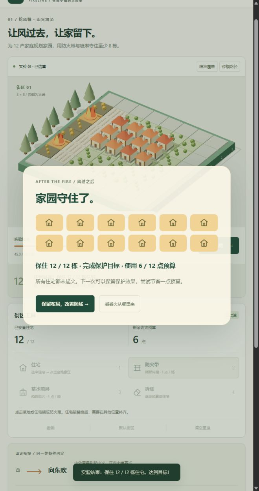
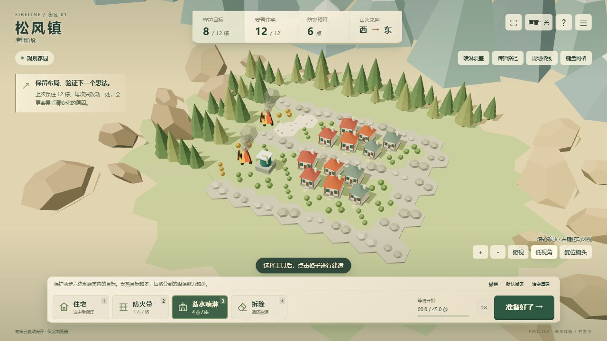

# 美术风格选型、资源规范与需求

## 1. 已确认选型

**近现代林缘小镇、木石小屋、温暖微缩模型风格已获用户确认。** 项目名保留《火线街区》，首关暂定名松风镇。本轮以程序模型落实首批造型，后续资源沿用同一方向。

玩家是事前规划家园的社区规划者。外部山火随风从西向东进入，木屋与草地可燃，清理植被形成隔离，蓄水喷淋在起火前降温。居民已转移，只表现家园损失。喷淋使用水罐、管道和喷头，不以消防车、治疗十字或救援人员为主体，避免暗示主动灭火与救人。

温暖不意味着没有威胁：准备亲近、危机清楚紧张、结算静下来看成果。首要标准是能读懂格子、建筑、热与保护状态。

| 选型 | 价值 | 取舍 |
| --- | --- | --- |
| 温暖微缩木石小镇（采用） | 简单几何即可产生家园感，材料与规则自洽 | 需明确火险状态，避免全程像无风险摆件 |
| 写实现代城市 | 现实识别度高 | 容易引出车队、室内救援、交通预期，超出范围 |
| 部落 / 中世纪村庄 | 自然材料容易统一 | 需重做喷淋技术与角色设定 |
| 灾难电影写实风 | 紧迫直接 | 资产成本高，烟雾破坏容易压过规则读图 |

## 2. 官方参考与使用边界

核对日期：2026-09-15。以下用于查看风格或评估候选资源，**本轮没有下载、导入或再分发其模型、截图、音乐**。借鉴点是本项目设计判断。

| 参考 | 建议观察 | 转化到本项目 | 使用边界 |
| --- | --- | --- | --- |
| [Dorfromantik 官方页](https://www.toukana.com/dorfromantik) | 村落与自然地块秩序、宁静乡野气氛 | 压低地面装饰对比，以住宅屋顶作视觉锚点 | 风格观察，不复制地图、模型或 UI |
| [Dorfromantik 官方 Presskit](https://www.toukana.com/dorfromantik/presskit) | 远近层级、地块轮廓、植被密度 | 斜俯视优先识别家园、空地、设施 | 仅链接；Presskit 不等于通用游戏资产授权 |
| [Kenney City Kit (Suburban)](https://kenney.nl/assets/city-kit-suburban) | 房屋轮廓、屋顶墙体比例、模块拆分 | 后续住宅替换候选，须统一木石材料语言 | 官方页面列 CC0；当前未使用，采用时登记具体包版本、文件与许可证 |

当前实现是第一份可运行参考：标题与关卡使用同一个 Three.js 场景，没有以概念图冒充游戏截图。模型见 `src/view.ts`，UI 色板见 `src/style.css`。

## 3. 色板与视觉语言

| 语义 | 色彩 / 材料 | 造型要求 |
| --- | --- | --- |
| 土地、林缘 | 鼠尾草绿 `#A4B888`、林木灰绿 `#69816A` | 大色面低对比；装饰树在地图外，不假装规则障碍 |
| 木石住宅 | 奶油墙 `#F5E4C5`、木梁 `#8B6348`、石基 `#9B9D8E` | 石基、木梁、坡顶、门窗，小而有重量感 |
| 屋顶 | 陶土橙 `#C76845`、暗陶土 `#AD523C` | 少量同功能色差，不暗示不同耐火数值 |
| 喷淋 | 蓄水青 `#417B72`、管道浅金属 `#D2BE89` | 圆罐、管道、喷头，轮廓区别住宅 |
| 防火带 | 裸土米色 `#DBCCB4` | 低平、无植被、清理纹理；不做高墙遮挡 |
| 预览 | 暖金 `#EFB85B`、非法红 `#D75242` | 必须配文字原因，颜色不是唯一信息 |
| 实际降温 | 水青 `#65D5E5` | 水纹仅由真实分配量驱动；范围不等于生效 |
| 受热 / 火焰 | 热橙 `#E77A38`、火橙 `#ED6339`、焰黄 `#FFBA4C` | 受热变色，起火新增火焰轮廓，不高频闪屏 |
| 烧毁 / 保住 | 灰褐 `#514F44`、灯光 `#FFD386` | 废墟压低建筑，保住的窗户亮灯，格子占地不缩小 |
| UI | 米白 `#FAF6E9`、墨绿 `#214C3C` | 标题留白、局内集中信息、结算先成果再日志 |

相机固定斜俯视正交，暖日光加环境补光。树木、烟团与浮字不得遮住落点；烟雾优先在场外。减少动态效果时保留静态可读状态。美术提升先看规则辨识，再加装饰。

## 4. 美术资源交付规范

以下是后续生产约定与预算目标，**不是当前版本已完成性能测量的结论**。

| 项目 | 规范 |
| --- | --- |
| 单位与坐标 | Y 向上，1 格 = 1 世界单位；底面中心为原点；正面 +Z；应用缩放与旋转 |
| 尺度 | 主体在 0.8 × 0.8 格内，檐口不超 0.95 格；住宅高约 0.9–1.1 格，喷淋约 1 格 |
| 交付 | 当前代码生成；外部模型优先 `.glb`，附可编辑源文件、预览、来源，不只交渲染图 |
| 拆分 | 住宅至少 base / body / roof / windows；喷淋 tank / pipe；模型不带游戏规则 |
| 面数目标 | 单住宅 ≤ 1,500 三角面，喷淋 ≤ 1,000，树 ≤ 300，装饰单件 ≤ 200；超出先实测 |
| 材质 | 优先共享纯色粗糙材质，金属度接近 0；每类模型 1–3 个共享材质；透明只用于必要效果 |
| 纹理 | 能用几何颜色表达则不加贴图；需要时用共用 512² / 1024² 图集，避免 4K 与每屋独立贴图 |
| 状态 | 完好、受热、起火、废墟、保住可展示；火焰水纹独立，不改变判定体积 |
| 动效 | 放置目标 120–180 ms；预警当前 2.4 s；少量循环，减少动态时静态可读 |
| 体积目标 | 单模型建议 ≤ 150 KB；首关新增外部美术优先 ≤ 2 MB；超出记录理由并实测加载 |
| 命名路径 | 如 `public/assets/models/house_woodstone_a.glb`、`public/assets/audio/ui_place.ogg`；英文小写语义名，加载兼容 Pages 子路径 |
| 来源 | 记录作者、原始 URL、包版本、许可证、修改与使用位置；AI 生成记录工具、提示词、日期及概念 / 实际资产用途 |

## 5. 美术需求清单

| ID | 资源 / 数量目标 | 优先级 / 体验项 | 必需内容 | 当前状态 |
| --- | --- | --- | --- | --- |
| ART-01 | 木石住宅 1 基础 + 2 变体 | P0 基础 / P1 变体；A02.1、B01 | 木梁、石基、门窗、屋顶；兼容五状态 | 基础型、屋顶色差已有；独立轮廓变体未做 |
| ART-02 | 蓄水喷淋 1 型 | P0；A06.2 | 水罐喷头；覆盖与实际生效区分 | 程序模型和降温环已有；过载提示待补 |
| ART-03 | 草地、裸土、石边界 3 类 | P0；A04.1 | 可燃 / 不燃易分，不混用路面语义 | 已有；新分区地形随 S2 配表调整 |
| ART-04 | 林缘树 1 型、远景烟 1 组 | P0 基础 / P1 丰富；A02.1 | 山火来自外部的线索 | 树已有；远烟未做 |
| ART-05 | 预览与放置反馈 1 套 | P0；A04 | 合法性、费用、覆盖、确认 | 格子文字覆盖已有；模型虚影与落地动效待补 |
| ART-06 | 火焰、受热、废墟、降温、保住 | P0；A06.2、A07 | 真实数据驱动、少遮挡 | 基础五状态已有；挡火瞬间和负载待补 |
| ART-07 | 标题、预警、结算 3 组 UI | P0；A02.2、A05、A07 | 同场景贯穿，信息层次不同 | 首批接入，待真实体验评估 |
| ART-08 | 放置、错误、预警、达标、结束 5 组音 | P0；A04.3、A07 | 可静音、操作后解锁 | Web Audio 合成接入；听感未验收 |
| ART-09 | 路牌、花箱、门廊 3 类生活物 | P1；B01 | 不改变判定和规则 | 门廊已有，其余暂缓 |
| ART-10 | 风声、火声、短配乐 | P1；B03 | 静音不影响判断 | 未制作 / 未采购 |

## 6. 验收和制作顺序

在实际游戏相机下查看完好、受热、燃烧、废墟、保住状态，同时开覆盖与路径，检查遮挡。缩小到实际画面尺寸，确认住宅、喷淋、隔离、空地能被区分，再无声通玩。

先用程序造型验证题材，只替换确实影响识别或吸引力的资源。本轮不采购、不引入外部模型依赖；采用外部资产前完成来源登记、尺度、子路径加载与性能检查。

## 7. 真实画面参考

下图为 v0.2 第一批本地生产构建，在窄长浏览器窗口的真实截图，用于核对标题与结果信息层次。不是最终概念图，也不代表真实移动设备验收通过。

## 8. 六边形山谷优化批次

用户追加方向：文明系列的自然地图层次、六边形、镜头缩放与高低变化、微缩住宅、沙地/雪山非游戏远景。参考为用户附图，不复制资产。

本轮已实现连续地表、默认隐藏格线/坐标、天然岩带、砂土防火带、程序雪峰与沙地、住宅屋顶/方向差异、焦木烟火和工作喷流，详见 [本轮设计](20-六边形山谷与镜头迭代.md)。后续继续优化院落、建筑结构变体、落地动画、负载反馈和触屏预览；首批程序模型不代表参考图级别的资产完成度。

